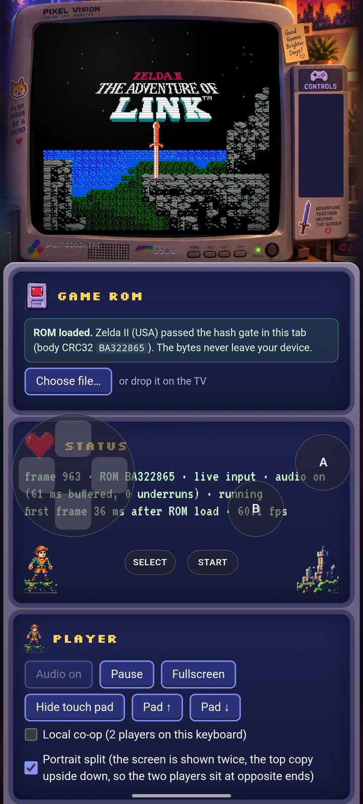
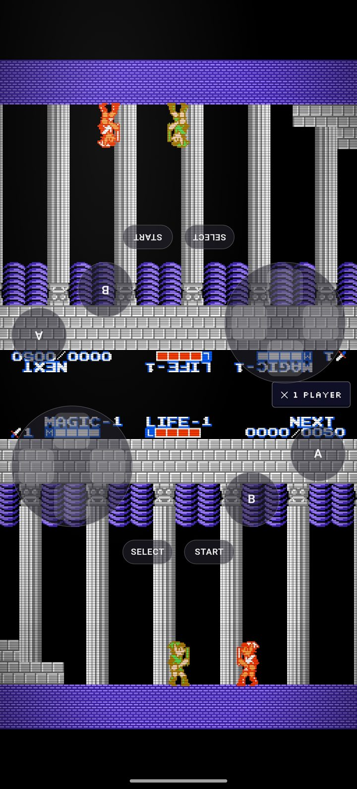
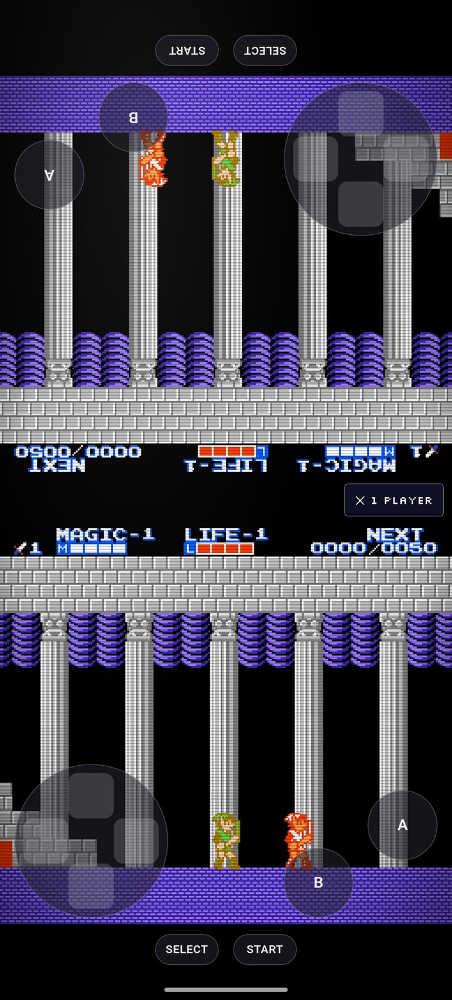
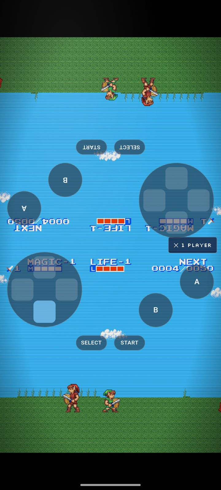

# Zelda II 2P Splitscreen — Android

[](https://github.com/doctormajid7-ux/z2rs-android-2p-splitscreen/releases/latest)
[](LICENSE)

**Two players, one phone, one half of the screen each.** An Android app that runs
[z2rs](https://github.com/troyedwardsjr/z2rs) — a clean-room-style reconstruction
of *Zelda II: The Adventure of Link* (NES) in Rust — with a **portrait split
screen**: the picture is shown twice, the top copy upside down, and each player
gets their own on-screen pad. The controls can be lifted off the screen edges,
and the app remembers your ROM, so it boots straight into the game.

This fork publishes **the Android build only**. The desktop and browser builds
come from the [upstream project](#the-upstream-project-desktop-and-browser).

**[⬇ Download the latest APK](https://github.com/doctormajid7-ux/z2rs-android-2p-splitscreen/releases/latest)**
· [All releases and release notes](https://github.com/doctormajid7-ux/z2rs-android-2p-splitscreen/releases)
· [Everything about the app, players and hackers alike](ANDROID.md)

## What you get

- **Mirrored two-player split screen.** Tick *Local co-op* and the screen is cut
  in two, the top copy rotated 180°, each player holding one end of the phone.
  Orientation locks to portrait while the mode is on.
- **Touch controls you can place.** Two pads, mirroring each other, that can be
  moved away from the edges together (**Pad ↑ / Pad ↓**) or hidden altogether.
- **Your ROM, remembered.** Pick your own `.nes` once — it is hash-checked and
  stays on the device, and the app reloads it on every launch.
- **HD graphics packs.** Point the app at a pack folder and the art goes up to
  4x; *Use original art* brings back the original graphics.
- **Working sound**, and the widescreen, save states, fast-forward, gamepad and
  online co-op features of z2rs are all still there.

## Screenshots

Zelda II running in the Android app.

| | |
|---|---|
|  |  |
|  |  |

## Install

1. Download
   [`z2rs-2p-splitscreen-0.1.0-debug.apk`](https://github.com/doctormajid7-ux/z2rs-android-2p-splitscreen/releases/latest/download/z2rs-2p-splitscreen-0.1.0-debug.apk)
   (866 KB) on your phone and open it. Android will ask you to allow installing
   from an unknown source.
2. Launch the app and, on the first run, pick your own Zelda II (USA) ROM when
   the **Game ROM** card asks for it.

Android **7.0 (API 24)** or newer. From a computer:

```sh
adb install -r z2rs-2p-splitscreen-0.1.0-debug.apk
```

The APK is a debug build signed with the debug key, and it contains **no ROM and
no HD pack**: bring both yourself.

```text
f5d9e5f749f2ba782e72d90ce5f8def9e7c2b6ecc2599d1bf8b271cdf104d4ed  z2rs-2p-splitscreen-0.1.0-debug.apk  (SHA-256)
```

## Two players on one phone

Tick **Local co-op** on the page. The screen becomes two copies of the game — the
top one upside down — and a second pad appears above it, so both players read
their half the right way up. **✕ 1 player**, halfway down the right edge, takes
you back to playing alone. If the pads sit awkwardly behind a case or a gesture
bar, **Pad ↑** and **Pad ↓** in the Player card slide both of them out of the way
at once; **Hide touch pad** removes them.

The same mode is in the desktop build, where it can be turned off with
`--split2p off`.

## Build the APK yourself

You need Rust stable with the `wasm32-unknown-unknown` target, `wasm-pack`, and a
JDK (17) with the Android SDK.

```sh
# the web bundle must include the HD feature, or the HD card stays inert
RUSTUP_TOOLCHAIN=stable wasm-pack build crates/z2-web --target web --out-dir site/pkg --features hd

cd android
JAVA_HOME=/usr/lib/jvm/java-17-openjdk ./gradlew assembleDebug
```

The APK lands in `android/app/build/outputs/apk/debug/`. Nothing external is
embedded unless you ask for it: `Z2_APK_ROM=/path/to/dump` and
`Z2_APK_HDPACK=/path/to/pack` are the only ways in, and both stay out of the
published APK. [ANDROID.md](ANDROID.md) has the details, and
[android/README.md](android/README.md) covers the shell itself.

## The upstream project (desktop and browser)

z2rs is a clean-room-style reconstruction of Zelda II: The Adventure of Link
(NES) in Rust. It runs as a desktop app and in the browser (WebAssembly), and it
is checked frame by frame against the original ROM running in a reference
emulator.

You bring your own ROM. Nothing from the original game is distributed here.
[PROVENANCE.md](PROVENANCE.md) records what reference material the project worked
from and where every file in this repository came from, and [LEGAL.md](LEGAL.md)
has the rules contributors follow.

On top of the original game, z2rs adds a few optional extras:

- widescreen, with real scenery in the margins instead of a stretched picture
- HD graphics packs, so you can repaint tiles and sprites at 2x to 8x
- two-player co-op with a second Link, on one machine or online
- save states, fast-forward, movie playback and gamepad support

Release announcement: [Moddable Zelda 2 PC / Web port with Online Multiplayer
Co-op and Widescreen
Released](https://x.com/troygentic/status/2101572848506573135). Chat is on
[Discord](https://discord.gg/buZrPenm6K).

### Play it on desktop

1. Download the archive for your system from the [upstream releases
   page](https://github.com/troyedwardsjr/z2rs/releases). There are builds for
   Linux, macOS (Intel and Apple Silicon) and Windows. Unpack it.
2. Start the launcher: `z2rs-launcher.exe` on Windows, `z2rs.app` on macOS,
   `z2rs-launcher` on Linux.
3. Pick your Zelda II (USA) ROM and press Play.

The launcher also sets the window size, fullscreen, widescreen (16:10, 16:9 or
21:9 ultrawide), an HD pack folder, and local or online co-op. Online co-op uses
a public signalling server by default, so two players only need to agree on a
room name.

Only one dump passes the check, identified by the hash of the ROM body with the
16-byte iNES header stripped: CRC32 `BA322865`, SHA1
`11333adb723a5975e0ecca3aee8f4747aa8d2d26` (No-Intro USA). The file is only ever
read in place — the Android app applies the same check.

Nothing in the archive is code signed. On macOS, right-click `z2rs.app` and
choose Open the first time, or use Open Anyway in System Settings > Privacy &
Security on newer versions. Windows SmartScreen wants More info and Run anyway,
and on Linux the files may need `chmod +x`.

From a terminal you can skip the launcher:

```sh
./z2rs --rom /path/to/zelda2.nes --scale 3
./z2rs --fullscreen
```

`z2-signal`, the third binary in the archive, is the signalling server for online
co-op. You only need it to host your own instead of using the public one.

### Build the desktop and browser builds from source

You need Rust stable (`cargo`, `rustc`). The browser build also needs the
`wasm32-unknown-unknown` target (`rustup target add wasm32-unknown-unknown`) and
`wasm-pack`.

```sh
make build          # cargo build --workspace (no ROM needed)
make test           # cargo test --workspace (tests that need a ROM skip without Z2_ROM)
export Z2_ROM=/path/to/zelda2.nes
make run            # play the optimized desktop build
make run-web        # build the wasm bundle and serve it on :8080
```

`make help` lists every target. A target that needs `Z2_ROM` prints what to set
and exits with status 2 when it is missing.

### Controls

| Action | Player 1 | Player 2 (co-op) |
|---|---|---|
| A | `Z` | `G` |
| B | `X` | `F` |
| Start | `Enter` | `T` |
| Select | `Shift` (either one) | `R` |
| D-pad | arrow keys | `W` `A` `S` `D` |

`Tab` fast-forward, `F5` save state, `F7` load state, `F6` next save slot, `P`
pause, `.` single-step while paused, `F11` or `Alt+Enter` fullscreen, `Esc` leave
fullscreen or quit. Gamepads work too.

### Guides

| Guide | What is in it |
|---|---|
| [guide/desktop.md](guide/desktop.md) | the launcher, every key, save-state slots, command-line flags, the config file, gamepads |
| [guide/browser.md](guide/browser.md) | the web build, its URL parameters, optional features and bundle size |
| [guide/co-op.md](guide/co-op.md) | two Links locally or online, widescreen, the portrait split, how they work and what they cannot do |
| [guide/hd-packs.md](guide/hd-packs.md) | making a pack by painting over spritesheets of the game (`make hd-sheets`, `make hd-pack`) and playing with it |
| [guide/development.md](guide/development.md) | repository layout, headless runs, and how the port is checked against the original |

### Contributing and legal

[CONTRIBUTING.md](CONTRIBUTING.md) covers setup, the pre-commit hook and the
rules for tests that need a ROM. [LEGAL.md](LEGAL.md) explains what may never be
committed. Read it before you open a pull request.

### License

The z2rs source code is released under the MIT license ([LICENSE](LICENSE)). The
license does not cover the original game, which you must supply yourself, nor the
community or Patreon HD graphics packs, which are licensed for personal use and
must not be redistributed.
